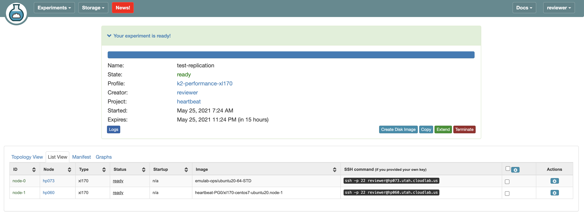

# Katran Performance Experiments


### Select katran-and-t-rex Profile


### Step 2: Configure The Nodes

The experiment consists of two nodes, labeled node-0 and node-1. Node-0 serves as the device-under-test (DUT) , which runs the **balancer_kern packet processing programs from katran**. Node-1 runs a traffic generator. By sending and receiving from the same machine, the traffic generator measures both the throughput and the round-trip latencies of packets that are processed by the device under test. 


##### Step 2.1: Update Node 1 (Traffic Generator) Configurations

1) SSH into node-1.  You can determine the name of the node-1 and node-0 machines from the CloudLab console (go to "list view" once the experiment is ready)

 

2) Generate SSH Key `ssh-keygen` and add it to cloudlab profile

3) Use your favorite text editor to add the following line to ~/.bash_profile.

   ```export PYTHONPATH=/usr/local/v2.87/automation/trex_control_plane/interactive``` 

4) Exit the session and log into node-1 again. 

5) Test ssh into node-0. 

6) Get mac address for ens1f1 interface.(For the next step)

7) Replace correct node0 in node0.config `sudo vim /usr/local/v2.87/node0.config`

##### Step 2.2: Update Node 0 (Katran) Configurations

1) `sudo su - `

2) Update mac address in `vim trex-configuration/katran/load_katran.sh` with the address you found in step 8 for step 2.1. 

**Note: If you want to load a different set of katran programs replace the path in trex-configuration/katran/copy_katran.py 

#### Step 3: Test Katran Setup 

`nohup python3 -u run_mlffr_katran.py -b balancer_kern data-jul-6 -n 3 -c 6 -mS 3 -mE 4 -i 0.1 > ~/run1.txt &`

Generate Graphs:
`python3 generate_graphs.py -d ~/Desktop/Katran-data/data-jul-7 -r 3 -b balancer_kern`
