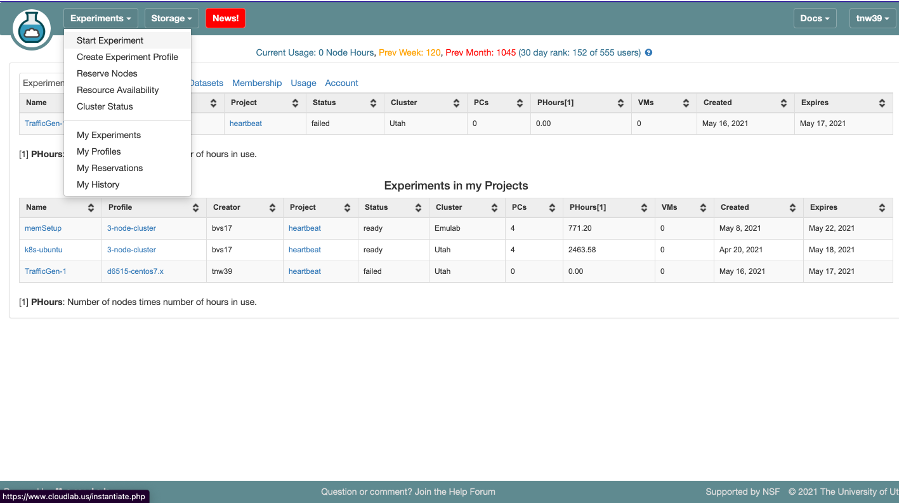
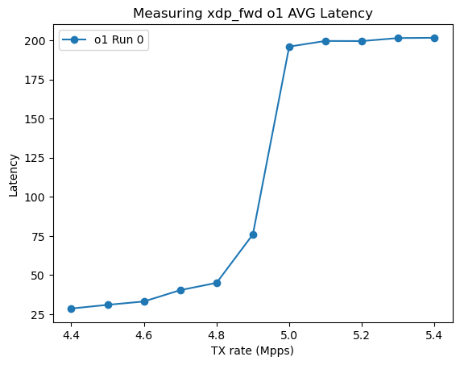
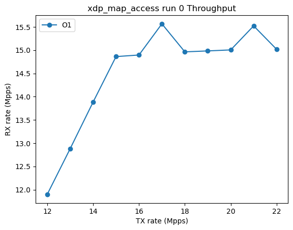

# Performance Experiments

This repository was used to evaluate K2. The following README demonstrates how to setup the evaulation setup in cloudlab. 

## Setup 

Estimate Time: 20 minutes

### Step 1: Create Experiment

Visit https://cloudlab.us/ and click the "Log in" button. You can use the reviewer account details (CloudLab account username and password provided in our SIGCOMM21 artifact hotCRP submission) to log into the CloudLab console.

#### Step 1.1: Start Experiment 


#### Step 1.2: Change Profile


#### Step 1.3: Select xl170-centos7-ubuntu20 Profile


#### Step 1.4: Name Experiment (optional)


#### Step 1.5: Start or Schedule Experiment
You can choose to start the experiment right away (just click "Finish" in the screen below) or schedule it to start at some time in the future. 

The default/initial duration for which an experiment may run (i.e., the time that the machines will be available to you) is 16 hours. You can extend an experiment later after the experiment boots up.


##### You may encounter the following failures/slow cases: 

Sometimes, starting an experiment can fail when CloudLab has insufficient resources available. If your experiment fails due to insufficient resources, you can check for future resource availability at https://www.cloudlab.us/resinfo.php -- look for future availability of machine instances of type "xl170" in the Utah cluster. You need at least 2 available machines for our experiment. You can also make reservations for machines at a future time by following instructions from http://docs.cloudlab.us/reservations.html. Please contact us if you have any difficulty.

If your experiment is successfully scheduled, it might still keep you waiting with the message `Please wait while we get your experiments ready`. This can happen sometimes since we use a custom disk image. Please be patient for a few minutes. 

Contact us or the CloudLab mailing list (https://groups.google.com/g/cloudlab-users) if you have any difficulties.

### Step 2: Setup The Nodes

The experiment consists of two nodes, labeled node-0 and node-1. Node-0 serves as the device-under-test (DUT), which runs the packet processing programs we're evaluating. Node-1 runs a traffic generator. 

#### Step 2.1: Update Node 1 (Traffic Gen) Configurations
1) SSH into node-1.  You can determine the name of the node-1 and node-0 machines from the CloudLab console (go to "list view" once the experiment is ready)
 
 
 
 You must use the private key provided as part of our hotCRP submission to login into the machine labeled node-1 (`hp125.utah.cloudlab.us` in the example above). Suppose you've named the file containing the private key (from hotCRP) `my.key`.  Type
 
 ```
 ssh -p 22 -i my.key reviewer@hp125.utah.cloudlab.us
 ```
 
3) Once logged into node-1, use your favorite text editor to add the line 

   ```export PYTHONPATH=/usr/local/v2.87/automation/trex_control_plane/interactive``` 

to ~/.bash_profile.

4) `cd /usr/local/trex-configuration/`

5) Run `./update-scripts.sh`. When prompted, enter the following details for your experiment. The user@DUT (device under test) string is `reviewer@<insert node-0 name you found above>` and the device type should be `xl170`. For the example shown above, the full exchange looks like the following:

```
reviewer@node-1 trex-configuration]$ ./update-scripts.sh 
Setting up some information
Enter DUT as (username@machine):reviewer@hp124.utah.cloudlab.us
Enter Device type (d6515 or xl170):xl170
```

6) Exit the session and log into node-1 again. 
 
#### Step 2.2: Upload the Given SSH Private Key to node-1

You will upload the SSH private key provided to you on hotCRP into node-1, so that it can remotely control node-0 (the DUT). Suppose your private key is stored in a file `my.key` on your local machine.

1) *On your own machine*, run the command
```
scp -i my.key my.key reviewer@hp125.utah.cloudlab.us:~/.ssh/id_ed25519
```

2) *On node-1*, test that you can ssh into node-0. _Do not skip this check!_ On the node-1 machine you're currently logged into, type 

```
ssh -p 22 reviewer@hp124.utah.cloudlab.us
```

where you will replace hp124.utah.cloudlab.us by the name of the node-0 machine from the CloudLab console. You should be able to connect to node-0. Then, exit out of node-0 session.

## Exercises
*Note: All DATA and logs, graphs are saved in your home directory on cloudlab. In order to view the graphs, copy the file to local computer. *

### Exercise 1: Run one version of a benchmark that DOES NOT drop packets. 
Estimated Run Time: 30 minutes
1) SSH into Node-1: e.g. `ssh -p 22 -i my.key reviewer@hp125.utah.cloudlab.us` where my.key is your private ssh key on your local computer and hp125 will be replace with node1 in your experiment.
2) Change to directory: `cd /usr/local/v2.87`
3) Start run: `nohup python3 -u run_mlffr.py -b xdp_fwd -v o1 -d xdp_fwd/ -n 1 -c 6 &`. This proccess will run in the background; therefore, press enter. 
4) Check progress of logs `tail -f $HOME/nohup.out`
5) Once it has completed running (it will say *Completed Full Script* in the logs), you will now generate the graphs. `cd /usr/local/trex-configuration/visualize-data-scripts/`
6) Generate throughput: `python3 rx_plot.py -d ~/xdp_fwd -v o1 -b xdp_fwd -r 0`
The graph will be located in the `$HOME/xdp_fwd/rx` directory and is called `0.png`.

 
 
6) Generate latency: `python3 latency.py -d ~/xdp_fwd -type avg -v o1 -b xdp_fwd`
The graph will be located in `$HOME/xdp_fwd/` directory and is called `o1_avgL.png`.

  

7) Copy Graphs and View Graphs on your computer. Execute the following on your LOCAL computer.   
`scp -i my.key reviewer@hp025.utah.cloudlab.us:/users/reviewer/xdp_fwd/rx/0.png .`  
`scp -i my.key reviewer@hp025.utah.cloudlab.us:/users/reviewer/xdp_fwd/o1_avgL.png .`   
where hp025 is node-1.

### Exercise 2: Run one version of a benchmark that DOES drop packets. 
Estimated Run Time: 30 minutes
1) SSH into Node-1: e.g. `ssh -p 22 -i my.key reviewer@hp125.utah.cloudlab.us` where my.key is your private ssh key on your local computer and hp125 will be replace with node1 in your experiment.
2) Change to directory: `cd /usr/local/v2.87`
3) Start run: `nohup python3 -u run_mlffr_user.py -b xdp_map_access -v o1 -d xdp_map -n 1 -c 6 > $HOME/map.txt &`. This proccess will run in the background; therefore, press enter. 
4) Check progress of logs `tail -f $HOME/map.txt`
5) Once it has completed running (it will say *Completed Full Script* in the logs), you will now generate the graphs. The logs are located in node0.
6) SSH to node0. e.g. `ssh -p 22 -i my.key reviewer@hp124.utah.cloudlab.us`
7) `cd /usr/local/trex-configuration/visualize-data-scripts/` 
8) Generate throughput: `python3 generate_user_graphs.py -d ~/xdp_map -v o1 -b xdp_map_access -r 0`
The graph will be located in `$HOME/xdp_map/rx/` and is called `0.png`.

 

7) Copy Graphs and View Graphs on your computer. Execute the following on your LOCAL computer.   
`scp -i my.key reviewer@hp024.utah.cloudlab.us:/users/reviewer/xdp_map/rx/0.png .`
where hp024 is node-0

### Exercise 3: Run all versions of a benchmark (that DOES NOT drop packets) three times each. 
Estimated Run time: 8 hours 
1) SSH into Node-1: e.g. `ssh -p 22 -i my.key reviewer@hp125.utah.cloudlab.us` where my.key is your private ssh key on your local computer and hp125 will be replace with node1 in your experiment.
2) Change to directory: `cd /usr/local/v2.87`
3) Start run: `nohup python3 -u run_mlffr.py -b xdp_fwd -d xdp_fwd_all -n 3 -c 6 > $HOME/xdp_fwd_log.txt &`. This proccess will run in the background; therefore, press enter. 
4) Check progress of logs `tail -f $HOME/xdp_fwd_log.txt`
5) Once it has completed running (it will say *Completed Full Script* in the logs), you will now generate the graphs.
`cd /usr/local/trex-configuration/visualize-data-scripts/` 
5) Generate throughput, drop rate, and latency graphs: `python3 generate_graphs.py -d xdp_fwd_all -b xdp_fwd -r 3`

### Exercise 4: Run all versions of a benchmark (that DOES drop packets) three times each. 
Estimated Run Time: 6 hours 
1) SSH into Node-1: e.g. `ssh -p 22 -i my.key reviewer@hp125.utah.cloudlab.us` where my.key is your private ssh key on  your local computer and hp125 will be replace with node1 in your experiment.
2) Change to directory: `cd /usr/local/v2.87`
3) Start run: `nohup python3 -u run_mlffr_user.py -b xdp_map_access -d xdp_map_all -n 3 -c 6 > $HOME/map_all.txt &`. This proccess will run in the background; therefore, press enter. 
4) Check progress of logs `tail -f $HOME/map_all.txt`
5) Once it has completed running (it will say *Completed Full Script* in the logs), you will now generate the graphs.
`cd /usr/local/trex-configuration/visualize-data-scripts/` 
5) Generate throughput graphs: `python3 generate_user_graphs.py -d ~/xdp_map_all -b xdp_map_access -r 3 -average`
