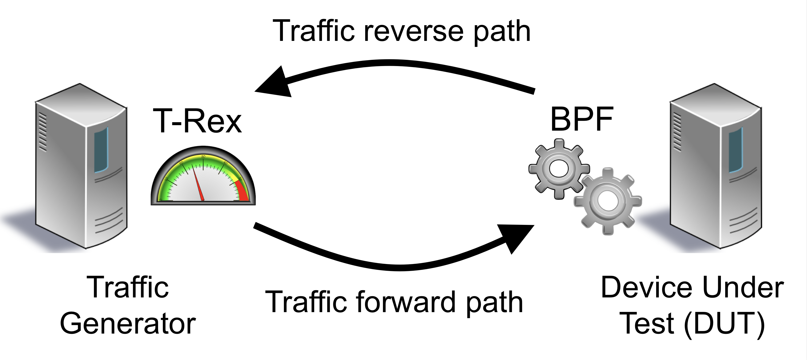
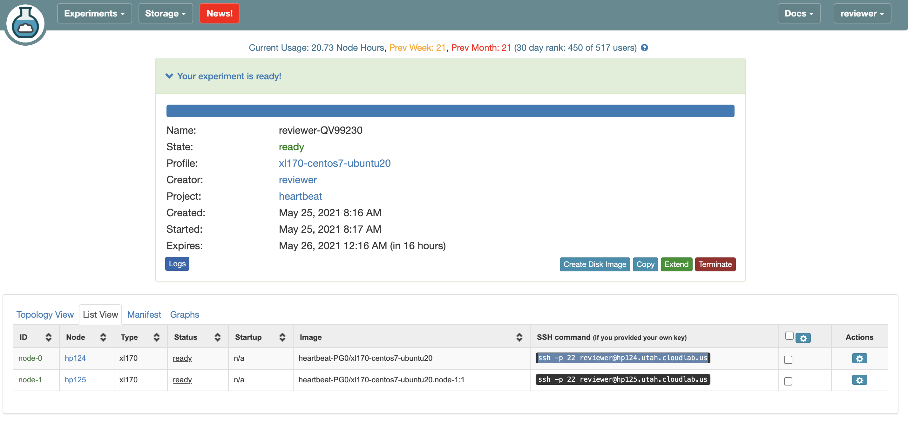

# Katran Performance Experiments

### CloudLab Experiment Setup 

[Estimated Human Time: 30 minutes]

#### Step 1: Create Experiment

Visit https://cloudlab.us/ and click the "Log in" button. Please use the CloudLab account username and password provided in our SIGCOMM21 artifact hotCRP submission to log into the CloudLab console.

##### Step 1.1: Start Experiment 


##### Step 1.2: Change Profile


##### Step 1.3: Select katran-and-t-rex Profile


##### Step 1.4: Name Experiment (optional)


##### Step 1.5: Start or Schedule Experiment
You can choose to start the experiment right away (just click "Finish" in the screen below) or schedule it to start at some time in the future. 

The default/initial duration for which an experiment may run (i.e., the time that the machines will be available to you) is 16 hours. You can extend an experiment later after the experiment boots up.


*You may encounter the following failures/slow cases:*

Sometimes, starting an experiment can fail when CloudLab has insufficient resources available. If your experiment fails due to insufficient resources, you can check for future resource availability at https://www.cloudlab.us/resinfo.php -- look for future availability of machine instances of type "xl170" in the Utah cluster. You need at least 2 available machines for our experiment. You can also make reservations for machines at a future time by following instructions from http://docs.cloudlab.us/reservations.html. Please contact us if you have any difficulty.

If your experiment is successfully scheduled, it might still keep you waiting with the message `Please wait while we get your experiments ready`. This can happen sometimes since we use a custom disk image. Please be patient for a few minutes. 

Contact us or the CloudLab mailing list (https://groups.google.com/g/cloudlab-users) if you have any difficulties.

#### Step 2: Configure The Nodes

The experiment consists of two nodes, labeled node-0 and node-1. Node-0 serves as the device-under-test (DUT) , which runs the **balancer_kern packet processing programs from katran**. Node-1 runs a traffic generator. By sending and receiving from the same machine, the traffic generator measures both the throughput and the round-trip latencies of packets that are processed by the device under test. The detailed setup is described in section 8 of the submitted paper.



##### Step 2.1: Update Node 1 (Traffic Generator) Configurations

1) SSH into node-1.  You can determine the name of the node-1 and node-0 machines from the CloudLab console (go to "list view" once the experiment is ready)

 

 2) Generate SSH Key `ssh-keygen` and add it to cloudlab profile

 3) Use your favorite text editor to add the following line to ~/.bash_profile.

   ```export PYTHONPATH=/usr/local/v2.87/automation/trex_control_plane/interactive``` 

4) `vim /usr/local/v2.87/stl/udp_for_benchmarks.py` and rewrite the file with the contents of udp_for_benchmarks_xl170_katran.py in this repository.

5) `sudo ip route add 10.200.200.1 via 10.10.1.1 dev ens1f1`

6) Exit the session and log into node-1 again. 

7) Test ssh into node-0. 

8) Get mac address for ens1f1 interface.(For the next step)

##### Step 2.2: Update Node 0 (Katran) Configurations

1) `sudo su - `

2) Update mac address in `vim trex-configuration/katran/load_katran.sh` with the address you found in step 8 for step 2.1. 

#### Step 3: Test Katran Setup 