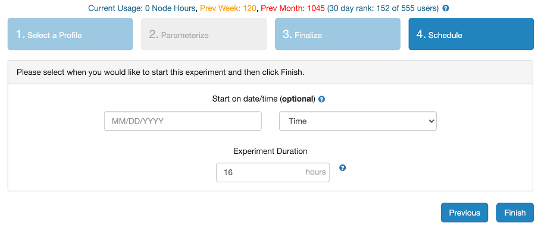
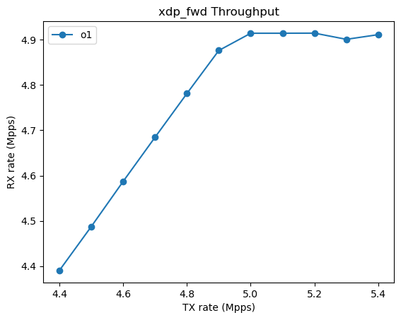

# Performance Experiments

## 7 Latency/Throughput Benefits
This section describes how to validate the experimental claim about latency/throughput improvements in code produced by K2. _This experiment takes the longest time to run among all our experiments._ (total estimated machine time: 15 hours, human time: 40 minutes). The high-level steps are as follows.

1) [Set up an experiment on the NSF CloudLab testbed](#CloudLab-Experiment-Setup) using credentials that we provided on hotCRP. 
2) Measure the latency-throughput profile of one benchmark which varies the offered load (Tx rate) and measures the corresponding processing rate (Rx rate), packet drop rate, and the round-trip latency of the packets that were successfully processed without drop. The experiment graphs these quantities as a function of the offered load. We will describe how to obtain the throughput (MLFFR) and the tail latency (latency at the MLFFR) of the benchmark from the corresponding curve.
3) Run a long-lived experiment that runs multiple benchmarks under different offered loads (Tx rate) and draws similar curves.

### CloudLab Experiment Setup 

[Estimated Human Time: 30 minutes]

#### Step 1: Create Experiment

Visit https://cloudlab.us/ and click the "Log in" button. Please use the CloudLab account username and password provided in our SIGCOMM21 artifact hotCRP submission to log into the CloudLab console.

##### Step 1.1: Start Experiment 


##### Step 1.2: Change Profile


##### Step 1.3: Select xl170-centos7-ubuntu20 Profile


##### Step 1.4: Name Experiment (optional)


##### Step 1.5: Start or Schedule Experiment
You can choose to start the experiment right away (just click "Finish" in the screen below) or schedule it to start at some time in the future. 

The default/initial duration for which an experiment may run (i.e., the time that the machines will be available to you) is 16 hours. You can extend an experiment later after the experiment boots up.



*You may encounter the following failures/slow cases:*

Sometimes, starting an experiment can fail when CloudLab has insufficient resources available. If your experiment fails due to insufficient resources, you can check for future resource availability at https://www.cloudlab.us/resinfo.php -- look for future availability of machine instances of type "xl170" in the Utah cluster. You need at least 2 available machines for our experiment. You can also make reservations for machines at a future time by following instructions from http://docs.cloudlab.us/reservations.html. Please contact us if you have any difficulty.

If your experiment is successfully scheduled, it might still keep you waiting with the message `Please wait while we get your experiments ready`. This can happen sometimes since we use a custom disk image. Please be patient for a few minutes. 

Contact us or the CloudLab mailing list (https://groups.google.com/g/cloudlab-users) if you have any difficulties.

#### Step 2: Configure The Nodes

The experiment consists of two nodes, labeled node-0 and node-1. Node-0 serves as the device-under-test (DUT), which runs the packet processing programs we're evaluating. Node-1 runs a traffic generator. By sending and receiving from the same machine, the traffic generator measures both the throughput and the round-trip latencies of packets that are processed by the device under test. The detailed setup is described in section 8 of the submitted paper.


##### Step 2.1: Update Node 1 (Traffic Generator) Configurations
1) SSH into node-1.  You can determine the name of the node-1 and node-0 machines from the CloudLab console (go to "list view" once the experiment is ready)
 
 
 
 You must use the private key provided as part of our hotCRP submission to login into the machine labeled node-1 (`hp125.utah.cloudlab.us` in the example above). Suppose you've named the file containing the private key (from hotCRP) `my.key`.  Type
 
 ```
 ssh -p 22 -i my.key reviewer@hp125.utah.cloudlab.us
 ```
 
 Sometimes, this step might fail with the error `Permission denied (publickey)`. If that happens to you, consider adding the private key to your SSH agent, using the command `ssh-add my.key` and re-try SSHing.
 
3) Once logged into node-1, use your favorite text editor to add the following line to ~/.bash_profile.

   ```export PYTHONPATH=/usr/local/v2.87/automation/trex_control_plane/interactive``` 


4) `cd /usr/local/trex-configuration/`

5) Run `./update-scripts.sh`. When prompted, enter the following details for your experiment. The user@DUT (device under test) string is `reviewer@<insert node-0 name you found above>` and the device type should be `xl170`. For the example shown above, the full exchange looks like the following:

```
reviewer@node-1 trex-configuration]$ ./update-scripts.sh 
Setting up some information
Enter DUT as (username@machine):reviewer@hp124.utah.cloudlab.us
Enter Device type (d6515 or xl170):xl170
```

6) Exit the session and log into node-1 again. 
 
##### Step 2.2: Upload the Given SSH Private Key to node-1

You will upload the SSH private key provided to you on hotCRP into node-1, so that it can remotely control node-0 (the DUT). Suppose your private key is stored in a file `my.key` on your local machine.

1) *On your own machine*, run the command
```
scp -i my.key my.key reviewer@hp125.utah.cloudlab.us:~/.ssh/id_ed25519
```

2) *On node-1*, test that you can ssh into node-0. _Do not skip this check!_ On the node-1 machine you're currently logged into, type 

```
ssh -p 22 reviewer@hp124.utah.cloudlab.us
```

where you will replace hp124.utah.cloudlab.us by the name of the node-0 machine from the CloudLab console. You should be able to connect to node-0. Then, exit out of node-0 session.

## Measure and Interpret One Benchmark Program

[Total Estimated Machine Time: 1 hour; Human Time: 10 minutes]

Now that the experiment is fully set up, we can stress test the DUT with traffic from the traffic generator at various offered loads (Tx rates) and look at how throughput (Rx rate) and latencies (average latency of packets returned to the traffic generator) vary with the offered load.  Some of our benchmarks just drop packets at high speeds (a useful capability in itself, e.g., for DDoS mitigation). For those benchmarks, we can only measure throughput as reported by a program running on the DUT itself. We show both kinds of programs (benchmarks that will forward packets back as well as those that just drop) below.  We consider the experiments in this section as "warm-ups" since they tell you how to measure and interpret one trial of one benchmark program; the full set of experiments for all benchmarks are in the next subsection. 

*Note: All DATA and logs, graphs are saved in your home directory on Cloudlab. The CloudLab server images don't come with GUIs, so in order to view graphs, you will need to copy the file to local computer. Instructions are provided below. *

### Warmup 1: Run one trial of benchmark that FORWARDS PACKETS BACK to the traffic generator. 
[Estimated Machine Run Time: 30 minutes; human time: 1 minute]

1) SSH into Node-1: e.g. `ssh -p 22 -i my.key reviewer@hp125.utah.cloudlab.us` where `my.key` is the private SSH key on your local computer and `hp125.utah.cloudlab.us` is replaced with the name of the `node-1` machine in your experiment.
2) Change to directory: `cd /usr/local/v2.87`
3) Start run: `nohup python3 -u run_mlffr.py -b xdp_fwd -v o1 -d xdp_fwd/ -n 1 -c 6 &`. This proccess will run in the background. Just press Enter. 
4) Check progress of logs `tail -f $HOME/nohup.out`
5) Once it has completed running (it will say *Completed Full Script* in the logs, takes about 30 minutes), you will now generate the graphs. `cd /usr/local/trex-configuration/visualize-data-scripts/`
6) Generate throughput graph: `python3 rx_plot.py -d ~/xdp_fwd -v o1 -b xdp_fwd -r 0`  
The graph will be located in the `$HOME/xdp_fwd/rx` directory and is called `0.png`. 
7) Generate latency graph: `python3 latency.py -d ~/xdp_fwd -type avg -v o1 -b xdp_fwd`  
The graph will be located in `$HOME/xdp_fwd/` directory and is called `o1_avgL.png`.
8) Copy the graphs and view them on your computer. *On your machine*, execute the following commands.
`scp -i my.key reviewer@hp025.utah.cloudlab.us:/users/reviewer/xdp_fwd/rx/0.png .`  
`scp -i my.key reviewer@hp025.utah.cloudlab.us:/users/reviewer/xdp_fwd/o1_avgL.png .`   
where you will replace `hp025.utah.cloudlab.us` with the name of your corresponding `node-1` machine.

#### Interpreting the graphs

Sample graphs that you obtain may look like the following:

 


### Warmup 2: Run one trial of a benchmark that DROPS ALL PACKETS.
[Estimated Machine Run Time: 30 minutes; human time: 1 minute]

1) SSH into Node-1: e.g. `ssh -p 22 -i my.key reviewer@hp125.utah.cloudlab.us` where my.key is your private ssh key on your local computer and hp125 will be replace with node1 in your experiment.
2) Change to directory: `cd /usr/local/v2.87`
3) Start run: `nohup python3 -u run_mlffr_user.py -b xdp_map_access -v o1 -d xdp_map -n 1 -c 6 > $HOME/map.txt &`. This proccess will run in the background; therefore, press enter. 
4) Check progress of logs `tail -f $HOME/map.txt`
5) Once it has completed running (it will say *Completed Full Script* in the logs), you will now generate the graphs. The logs are located in node0.
6) SSH to node0. e.g. `ssh -p 22 -i my.key reviewer@hp124.utah.cloudlab.us`
7) `cd /usr/local/trex-configuration/visualize-data-scripts/` 
8) Generate throughput graph: `python3 generate_user_graphs.py -d ~/xdp_map -v o1 -b xdp_map_access -r 0`  
The graph will be located in `$HOME/xdp_map/rx/` and is called `0.png`.
7) Copy Graphs and View Graphs on your computer. Execute the following on your LOCAL computer.   
`scp -i my.key reviewer@hp024.utah.cloudlab.us:/users/reviewer/xdp_map/rx/0.png .`
where hp024 is node-0


### Exercise 3: Run all versions of a benchmark (that DOES NOT drop packets) three times each. 
Estimated Run time: 8 hours 
1) SSH into Node-1: e.g. `ssh -p 22 -i my.key reviewer@hp125.utah.cloudlab.us` where my.key is your private ssh key on your local computer and hp125 will be replace with node1 in your experiment.
2) Change to directory: `cd /usr/local/v2.87`
3) Start run: `nohup python3 -u run_mlffr.py -b xdp_fwd -d xdp_fwd_all -n 3 -c 6 > $HOME/xdp_fwd_log.txt &`. This proccess will run in the background; therefore, press enter. 
4) Check progress of logs `tail -f $HOME/xdp_fwd_log.txt`
5) Once it has completed running (it will say *Completed Full Script* in the logs), you will now generate the graphs.
`cd /usr/local/trex-configuration/visualize-data-scripts/` 
5) Generate throughput, drop rate, and latency graphs: `python3 generate_graphs.py -d xdp_fwd_all -b xdp_fwd -r 3`

### Exercise 4: Run all versions of a benchmark (that DOES drop packets) three times each. 
Estimated Run Time: 6 hours 
1) SSH into Node-1: e.g. `ssh -p 22 -i my.key reviewer@hp125.utah.cloudlab.us` where my.key is your private ssh key on  your local computer and hp125 will be replace with node1 in your experiment.
2) Change to directory: `cd /usr/local/v2.87`
3) Start run: `nohup python3 -u run_mlffr_user.py -b xdp_map_access -d xdp_map_all -n 3 -c 6 > $HOME/map_all.txt &`. This proccess will run in the background; therefore, press enter. 
4) Check progress of logs `tail -f $HOME/map_all.txt`
5) Once it has completed running (it will say *Completed Full Script* in the logs), you will now generate the graphs.
`cd /usr/local/trex-configuration/visualize-data-scripts/` 
5) Generate throughput graphs: `python3 generate_user_graphs.py -d ~/xdp_map_all -b xdp_map_access -r 3 -average`


## 8 Efficacy of safety checks (Table 7 in the submitted paper appendix)

This section evaluates whether the programs optimized by K2 can pass the kernel verifier. We check this by
loading the programs in the kernel. If the program can be successfully loaded, it means this program passes
the kernel verifier. Otherwise, we will receive the error information from kernel. Since it takes long time 
(more than 12 hours) for K2 to optimize all benchmarks in the table, we directly use the optimized programs 
produced by K2 from the [log](https://github.com/smartnic/throughput-experiments/tree/main/completed-programs) 
that were produced when we submitted the manuscript.

Note: There is a typo in Table 7 in the submitted paper. K2 produced 3 unique programs for benchmark 
`xdp_pktcntr` instead of 5. We will fix it in the camera-ready version.

### Run

Estimated runtime: 2 minutes 30 seconds

SSH into Node-0: suppose currently you are on the node-0 machine
```
ssh -p 22 reviewer@hp124.utah.cloudlab.us
```
where you will replace hp124.utah.cloudlab.us by the name of the node-0 machine from the CloudLab console.

```
cd /usr/local/trex-configuration/safety_chk
sudo python3 safety_chk.py
```

#### Expected result:
```
+-----------------+---------------------+------------------------------+
|    Benchmark    | # variants produced | # accepted by kernel checker |
+-----------------+---------------------+------------------------------+
|       xdp2      |          5          |              4               |
|      xdp_fw     |          5          |              5               |
| xdp_router_ipv4 |          5          |              4               |
|     xdp_fwd     |          5          |              5               |
|   xdp_pktcntr   |          3          |              3               |
|       xdp1      |          5          |              5               |
|  xdp_map_access |          5          |              5               |
|   xdp_redirect  |          5          |              4               |
+-----------------+---------------------+------------------------------+
```
