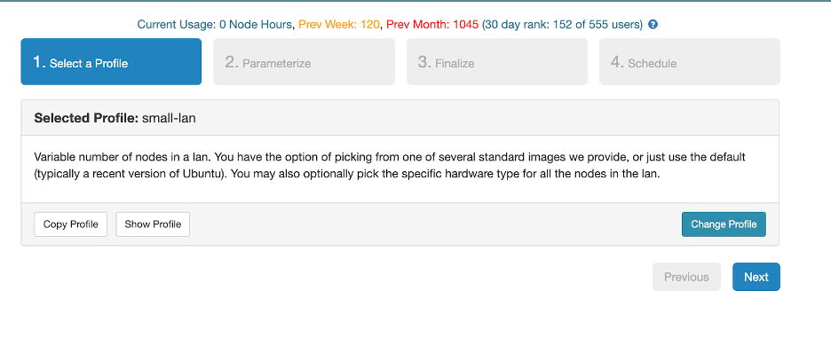
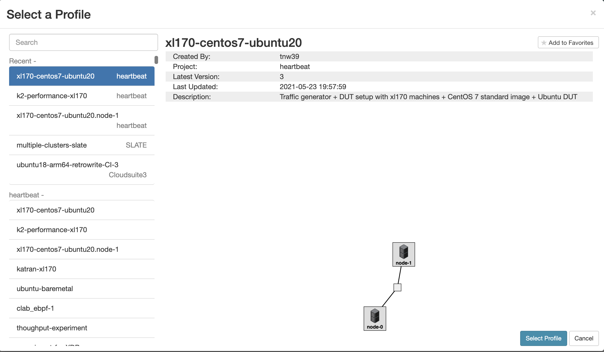
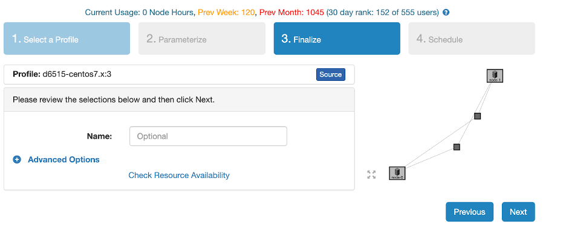

# Performance Experiments

This repository was used to evaluate K2. The following README demonstrates how to setup the evaulation setup in cloudlab. 

## Setup 

Estimate Time: 20 minutes

### Step 1: Create Experiment
#### Step 1.1: Start Experiment 

#### Step 1.2: Change Profile

#### Step 1.3: Select Profile

#### Step 1.4: Name Experiment (optional)

#### Step 1.5: Schedule Experiment

### Step 2: Setup Nodes
#### Step 2.1: Update Node 1 Configurations
1) SSH into Node1. 
2) Add `export PYTHONPATH=/usr/local/v2.87/automation/trex_control_plane/interactive` to ~/.bash_profile
3) `cd /usr/local/trex-configuration/`
4) Run ./update-scripts.sh. When prompted, enter the node0 for your experiment and type xl170.
5) Exit session and login again. 
 
#### Step 2.2: Create SSH Key
1) Generate ssh key. `ssh-keygen`  (press enter for all the prompts)
2) Add SSH key into Cloudlab

4) Wait 5-10 minutes. Cloud lab takes a bit of time to update your ssh key. Then, test ssh into the node0 from node 1. This step is necessary, do not skip!

#### Step 2.3: Update Node0 Configurations
1) SSH into Node0
2) `./setup_dut.sh ens1f1`. Type in Y when it prompts and enter xl170 when it prompts for a device.

## Exercises
*Note: All DATA and logs, graphs are saved in your home directory*

### Exercise 1: Run one version of a benchmark that DOES NOT drop packets. 
Estimated Run Time: 30 minutes
1) Change to directory: `cd /usr/local/v2.87`
2) Start run: `nohup python3 -u run_mlffr.py -b xdp_fwd -v o1 -d xdp_fwd/ -n 1 -c 6 &`
3) Check progress of logs `tail -f $HOME/nohup.out`
4) Once it has completed running (it will say *Completed Full Script* in the logs), you will now generate the graphs. 
5) Generate throughput: `python3 rx_plot.py -d ~/xdp_fwd -v O1 -b xdp_fwd -r 0`
6) Generate latency: `python3 latency.py -d ~/xdp_fwd -type avg -v O1 -b xdp_fwd`

### Exercise 2: Run one version of a benchmark that DOES drop packets. 
Estimated Run Time: 30 minutes
1) Change to directory: `cd /usr/local/v2.87`
1) Start run: `nohup python3 -u run_mlffr_user.py -b xdp_map_access -v o1 -d xdp_map -n 1 -c 6 > $HOME/map.txt &`
2) Check progress of logs `tail -f $HOME/map.out`
3) Once it has completed running (it will say *Completed Full Script* in the logs), you will now generate the graphs. 
4) Generate throughput: `python3 generate_user_graphs.py -d ~/xdp_map -v O1 -b xdp_map_access -r 0`

### Exercise 3: Run all versions of a benchmark (that DOES NOT drop packets) three times each. 
Estimated Run time: 6 hours 
1) Change to directory: `cd /usr/local/v2.87`
2) Start run: `nohup python3 -u run_mlffr.py -b xdp_fwd -d xdp_fwd_all -n 3 -c 6 > $HOME/xdp_fwd_log.txt &`
3) Check progress of logs `tail -f $HOME/xdp_fwd_log.out`
4) Once it has completed running (it will say *Completed Full Script* in the logs), you will now generate the graphs. 
5) Generate throughput, drop rate, and latency graphs: `python3 generate_graphs.py -d xdp_fwd_all -b xdp_fwd -r 3`

### Exercise 4: Run all versions of a benchmark (that DOES drop packets) three times each. 
Estimated Run Time: 6 hours 
1) Change to directory: `cd /usr/local/v2.87`
2) Start run: `nohup python3 -u run_mlffr_user.py -b xdp_map_access -d xdp_map_all -n 3 -c 6 > $HOME/map_all.txt &`
3) Check progress of logs `tail -f $HOME/map_all.out`
4) Once it has completed running (it will say *Completed Full Script* in the logs), you will now generate the graphs. 
5) Generate throughput graphs: `python3 generate_user_graphs.py -d ~/xdp_map_all -b xdp_map_access -r 3 -average`
